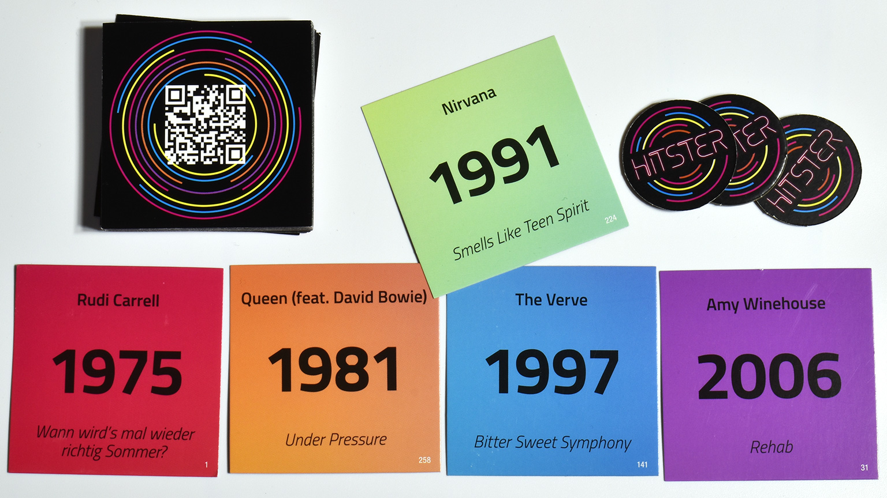
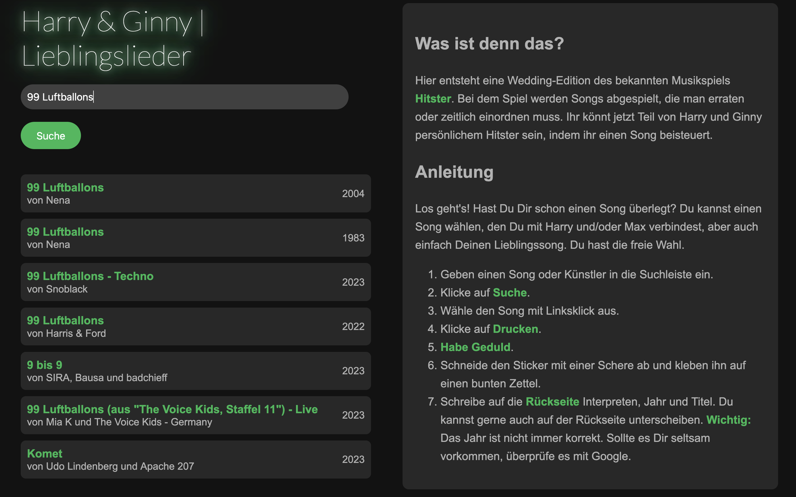
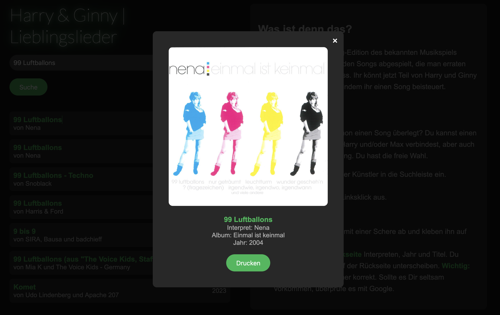
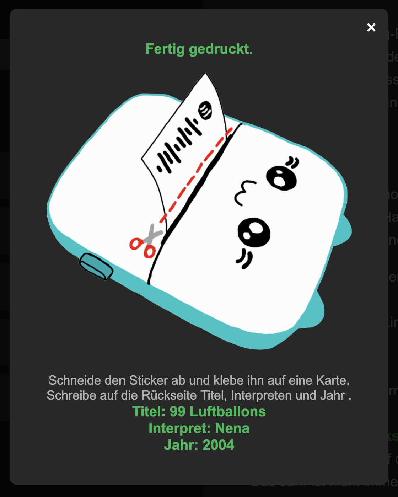
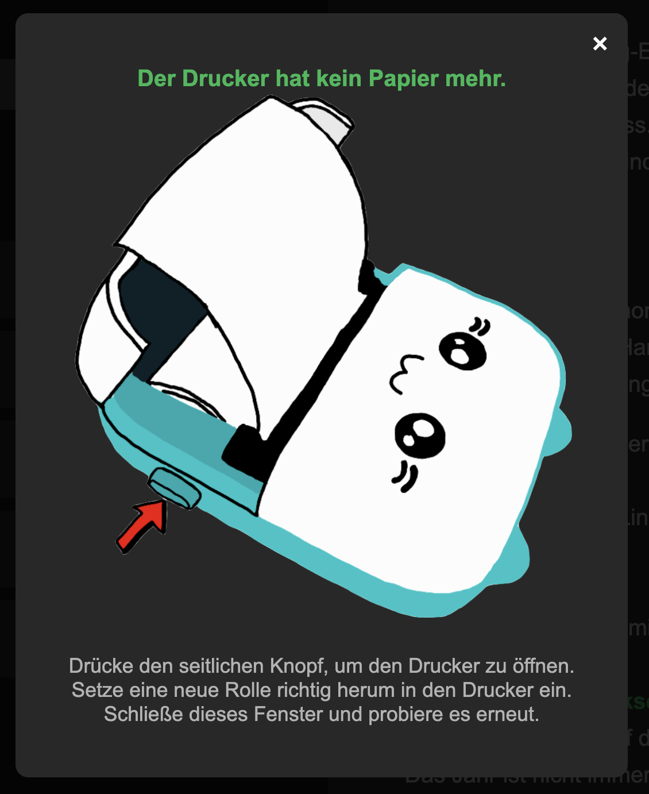
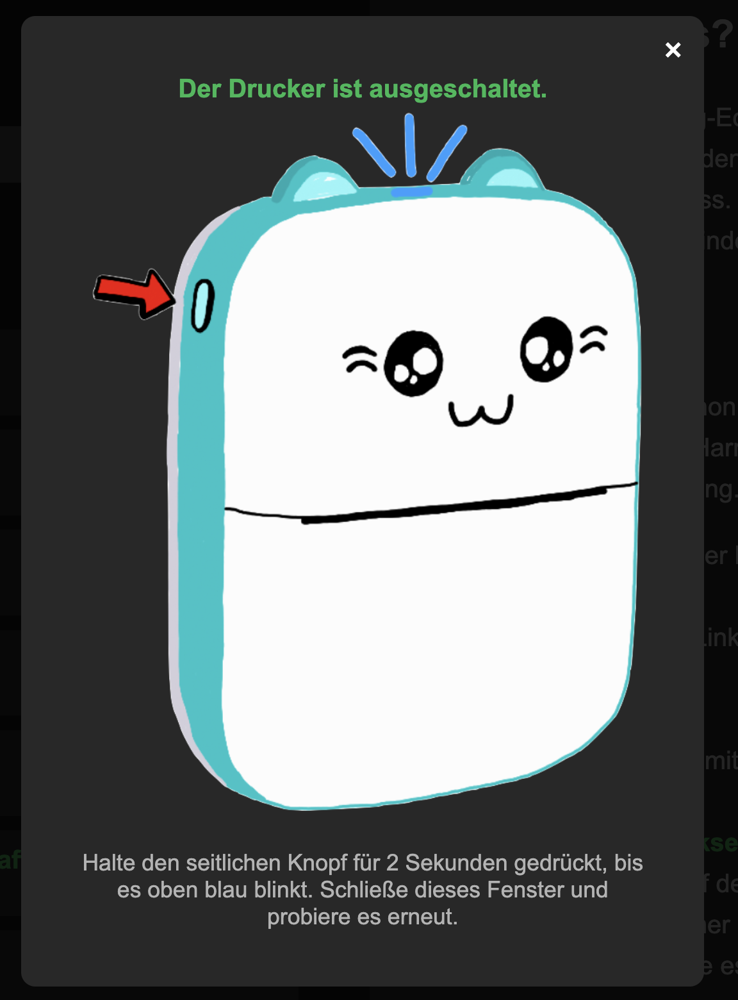
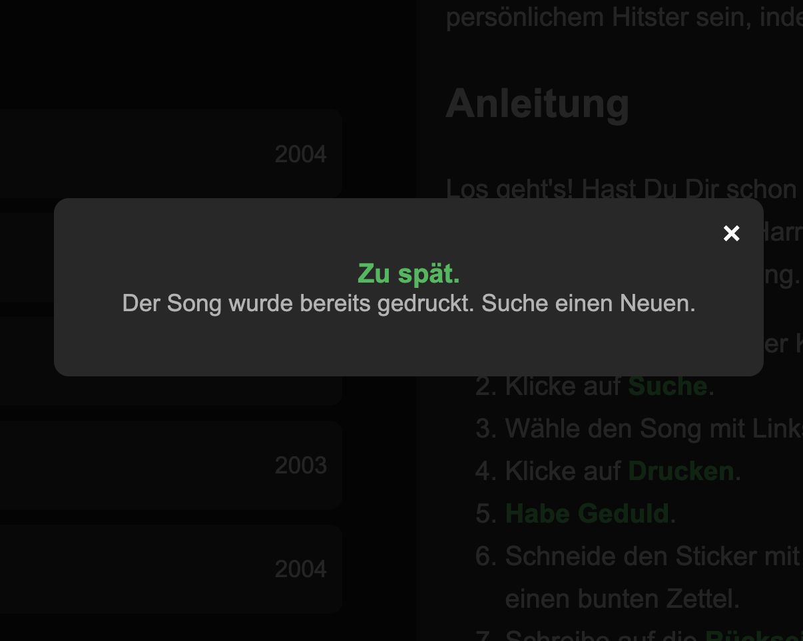

Based on [Spotify Code One-Click](https://github.com/PaulMBarg/Spotify-Code-OneClick/blob/main/README.md?plain=1) and [catprinter](https://github.com/NaitLee/Cat-Printer).

# DIY Hitster for Events

This repo helps you create a personilzed version of the popular music game Hasbro. It hosts a user-interface as web app where guest of the event (e.g. wedding) can create their own Hitster music cards.

## Hitster
[Hitster](https://hitstergame.com/de-de/) is a music guessing game from Jumboplay. You need to listen to differnt songs and order them chronological. Each song has a card, with a Spotify QR Code on the one side and the release year, titel, album and interpret on the other.

## Personalized Version
What this software provides is an easy-to-use interface that allows guest to search for their songs and then prints the Spotify Code on a sticker. Then the guest can stick it to a piece of paper (must be prepared) and write the year, interpret and album on the backside.
That's it, this is how you can create a very personlized, special gift. 

## Printer
The printer I used is the so called "Catprinter" from Amazon. I chosed it, because I found a repo on Github that reversed engineered the bluetooth control of this printer. And it is small and can print directly on sticky paper. 

## How to start?
Run `app.py`. Go to `http://127.0.0.1:5002/`. Delete all files in `/Downloads` except `list.txt`. `list.txt` should be empty. Change the names, just search for `Harry & Ginny`, `Harry und Ginny` and `Harry und/oder Ginny` (in `index.html` in line `206`, `227`, `233`).

## Gallery

